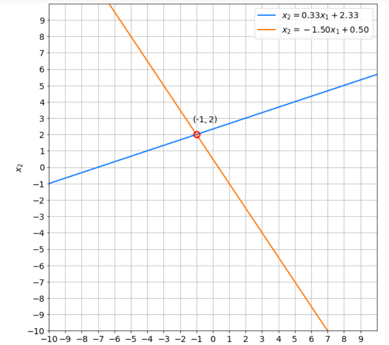

# Linear systems as matrices

We need matplotlib (Maths Plot Library) to draw plots(Lines)

```python
import numpy as np
import matplotlib.pyplot as plt
from utils import plot_lines
```

we can write

$$
\begin{cases}-x_1 + 3x_2 = 7, \\ 3x_1 + 2x_2 = 1,\end{cases}
$$

as 

$$
\begin{bmatrix}-1 & 3 & 7 \\ 3 & 2 & 1\end{bmatrix}
$$

This is the augmented matrix. It includes coefficients and constant values.

We divide that into 2 parts as A = coefficients and b = constants

$$
A = \begin{bmatrix}-1&  3\\ 3&2\end{bmatrix}
$$

$$
b = \begin{bmatrix}7\\ 1\end{bmatrix}
$$

We show it on numpy as below

```python
A = np.array([
        [-1, 3],
        [3, 2]
], dtype=np.dtype(float))

b = np.array([7, 1], dtype=np.dtype(float))

print("Matrix A:")
print(A)
'''Matrix A:
[[-1.  3.]
 [ 3.  2.]]'''
 
print("Array b:")
print(b)
'''Array b:
[7. 1.]'''
```

### How to solve these using Numpy

- Syntax: `np.linalg.solve(Coefficient array, Constants array)`

```python
x = np.linalg.solve(A, b)

print(f"Solution: {x}") #Solution: [-1.  2.]
```

### Determinant of matrix using numpy

- Syntax: `np.linalg.det()`

```python
d = np.linalg.det(A)

print(f"Determinant of matrix A: {d:.2f}") # -11.00
```

> Meaning of `{d: .2f}`
> 
> - This says computer to give the answer with 2 decimal points
> - `d`: This is the variable name
> - **`:`**: This tells the computer, "Wait, I have some special instructions for how to format this."
> - **`.2`**: This is the "Precision." It tells the computer to keep exactly **2 digits** after the decimal point.
> - **`f`**: This stands for **Fixed-point**. It tells the computer to treat the number like a standard decimal

---

## Visualizing 2x2 systems as plotlines

### Representing the system as a matrix

Now we have A and b matrices. To show it on a plot, we need to create an augmented matrix

To do that, we need to connect A and b. But here b is a vertical vector. So we need to turn b into a horizontal position and connect it to A

```python
A_system = np.hstack((A, b.reshape((2,1))))
print(A_system)
'''[[-1.  3.  7.]
 [ 3.  2.  1.]]'''
```

Why this much of brackets?

- `np.hstack` is designed to take exactly **one** thing: a list or tuple of arrays.
    - If you wrote `np.hstack(A, b)`, the computer thinks `A` is the data and `b` is some other setting (like a color or a size).
    - By adding the second set of parentheses `(A, b)`, we say "Here is **one** package containing both items I want you to glue together."
- The `.reshape()` function needs to know the new "dimensions" (rows and columns) of the array. In NumPy, a **shape** is always represented as a tuple.
    - The first number `2` is the number of rows.
    - The second number `1` is the number of columns.

---

### Graphical Representation of the solution

```python
plot_lines(A_system)
```



> When we draw plot lines for singular systems (Which det = 0), what they show is
> 
> - 2 Parallel lines for systems with no solutions
> - One single line for systems with infinite number of solutions
